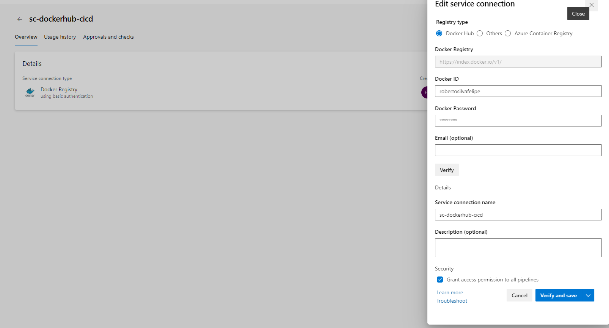

# Projeto Final - CI/CD Jornada Devops 

## Introdução 
Este projeto implementa uma pipeline de Integração e Entrega Contínua (CI/CD) utilizando o Azure DevOps. A pipeline está configurada para executar testes automáticos, construir uma imagem Docker e realizar o push para um registro de containers. Além disso, a pipeline está configurada para implantar a aplicação em um ambiente de Container Apps no Azure.

## Iniciando 

### 1. Processo de instalação 
Para configurar este projeto no seu ambiente local, siga os passos abaixo:

1. Clone o repositório do Azure DevOps para sua máquina local:
    ```bash
    git clone <URL_DO_REPOSITORIO_AZURE_DEVOPS>
    ```
2. Navegue até o diretório clonado:
    ```bash
    cd <NOME_DO_DIRETORIO>
    ```

### 2. Softwares e requisitos 
As dependências de software para este projeto incluem:

- **Azure DevOps**: Para configuração e execução das pipelines.
- **Docker**: Para construção e push das imagens Docker.
- **Python 3.x**: Para execução dos testes automatizados.
- **Container Apps**: Ter um container apps deployado na azure (ou outro similar) para deploy da aplicação
- **Terraform**: (opcional, para configuração de infraestrutura como código em um momento posterior).


## Build and Test

### Pipeline de CI/CD
A configuração da pipeline está definida no arquivo `azure-pipelines.yaml`.

#### Arquivo `azure-pipelines.yaml`

```yaml
trigger:
- main

pool:
  vmImage: 'ubuntu-latest'

variables:
  - group: 'variable-group-app'  # Nome do variable group criado no Azure DevOps

stages:
- stage: Test
  jobs:
  - job: RunTests
    displayName: 'Run Tests'
    steps:
    - task: UsePythonVersion@0
      inputs:
        versionSpec: '3.x'
        addToPath: true
    - script: |
        python -m venv venv
        source venv/bin/activate
        pip install -r requirements.txt
        cd tests
        pytest
      displayName: 'Run Unit Tests'

- stage: Build
  dependsOn: Test
  jobs:
  - job: BuildDockerImage
    displayName: 'Build Docker Image'
    steps:
    - script: |
        echo $(DOCKER_HUB_PASSWORD) | docker login -u $(DOCKER_HUB_USERNAME) --password-stdin
      displayName: 'Login to Docker Hub'
    - script: |
        docker info
        docker images
      displayName: 'Docker Info and Images'
    - task: Docker@2
      inputs:
        containerRegistry: 'sc-dockerhub-cicd'  # Referência à conexão de serviço configurada na biblioteca
        repository: 'robertosilvafelipe/nginx-custom'
        command: 'buildAndPush'
        Dockerfile: '**/Dockerfile'
        buildContext: '$(Build.SourcesDirectory)'
        tags: |
          $(Build.BuildId)
    - script: |
        docker images
        echo "Docker build and push completed successfully"
      displayName: 'Log Build Completion'

- stage: Deploy
  dependsOn: Build
  jobs:
  - deployment: DeployToContainerApps
    displayName: 'Deploy to Azure Container Apps'
    environment: 'staging'
    strategy:
      runOnce:
        deploy:
          steps:
          - script: |
              az login --service-principal -u $(servicePrincipalId) -p $(servicePrincipalKey) --tenant $(tenantId)
              az containerapp update --name $(containerAppName) --resource-group $(resourceGroup) --image robertosilvafelipe/nginx-custom:$(Build.BuildId)
            displayName: 'Deploy to Azure Container Apps'
          - script: |
              echo "Deployment initiated, waiting for application to start..."
              sleep 10
              app_url=$(az containerapp show --name $(containerAppName) --resource-group $(resourceGroup) --query "properties.configuration.ingress.fqdn" -o tsv)
              echo "Application URL: https://$app_url"
              response=$(curl -s -o /dev/null -w "%{http_code}" https://$app_url)
              echo "HTTP Response Code: $response"
              if [ $response -eq 200 ]; then
                echo "Application is running successfully."
              else
                echo "Application is not responding as expected."
                exit 1
              fi
            displayName: 'Verify Application Status'
```

### Executando a Pipeline no Azure DevOps

1. **Service Connection**: Configure uma conexão de serviço para o Docker Hub e outra para o Azure Container Apps. Certifique-se de que as credenciais estão corretas e que a conexão está funcionando.

#### Configurando uma Conexão de Serviço para o Docker Hub

1. **Navegue até o Projeto no Azure DevOps**:
   - Abra o Azure DevOps e navegue até o projeto onde você deseja configurar a conexão de serviço.

2. **Acessar Configurações do Projeto**:
   - No menu lateral esquerdo, clique em "Project settings" (Configurações do projeto).

3. **Selecionar Service Connections**:
   - Na seção "Pipelines", clique em "Service connections".

4. **Adicionar uma Nova Conexão de Serviço**:
   - Clique no botão "New service connection" (Nova conexão de serviço) no canto superior direito.

5. **Escolher o Tipo de Serviço**:
   - Selecione "Docker Registry" e clique em "Next" (Próximo).

6. **Configurar Detalhes da Conexão**:
   - **Registry type**: Escolha "Docker Hub".
   - **Docker Registry**: Deixe como `https://index.docker.io/v1/`.
   - **Docker ID**: Insira seu nome de usuário do Docker Hub.
   - **Password**: Insira sua senha do Docker Hub.
   - **Service connection name**: Dê um nome descritivo para sua conexão, por exemplo, `dockerhub-connection`.

7. **Verificar e Salvar**:
   - Clique em "Verify" para testar a conexão. Se estiver tudo correto, clique em "Save" para salvar a conexão de serviço.




#### Configurando uma Conexão de Serviço para o Azure Container Apps

1. **Adicionar uma Nova Conexão de Serviço**:
   - No mesmo local das conexões de serviço, clique novamente em "New service connection".

2. **Escolher o Tipo de Serviço**:
   - Selecione "Azure Resource Manager" e clique em "Next".

3. **Escolher o Método de Autenticação**:
   - Escolha "Service principal (automatic)" para que o Azure DevOps crie automaticamente um principal de serviço para você.

4. **Configurar Detalhes da Conexão**:
   - **Subscription**: Selecione a assinatura do Azure que contém seus recursos do Container Apps.
   - **Resource Group**: Selecione o grupo de recursos onde seu Container App está localizado.
   - **Service connection name**: Dê um nome descritivo para a conexão, por exemplo, `azure-container-apps-connection`.

5. **Verificar e Salvar**:
   - Clique em "Verify and save" para testar e salvar a conexão.

### Nota Importante:

Se você estiver utilizando um registro de container local ou outro tipo de registro, a configuração será diferente. Por exemplo:

- **Docker Registry Local**: 
  - **Registry type**: Escolha "Other" em vez de "Docker Hub".
  - **Docker Registry**: Insira a URL do seu registro local.
  - **Docker ID**: Insira o nome de usuário do seu registro local.
  - **Password**: Insira a senha do seu registro local.
  - **Service connection name**: Dê um nome descritivo, como `local-registry-connection`.

Após configurar as conexões de serviço, certifique-se de que as credenciais estão corretas e que a conexão está funcionando corretamente, pois isso é crucial para o sucesso da execução da pipeline.


2. **Agent Pool**: Utilize o agente padrão do Azure DevOps `ubuntu-latest` conforme especificado na pipeline.

3. **Variable Group**: Crie um grupo de variáveis no Azure DevOps chamado `variable-group-app` e adicione as seguintes variáveis:
   - `DOCKER_HUB_USERNAME`: Seu nome de usuário do Docker Hub.
   - `DOCKER_HUB_PASSWORD`: Sua senha do Docker Hub.
   - `servicePrincipalId`: ID do service principal para login no Azure.
   - `servicePrincipalKey`: Chave do serviço principal para login no Azure.
   - `tenantId`: ID do tentant do Azure.
   - `containerAppName`: Nome do container apps no Azure.
   - `resourceGroup`: Resource Group no Azure.

4. **Pipeline Execution**:

    #### Criando a Pipeline

    1. **Navegue até a seção de Pipelines**: No Azure DevOps, vá até o seu projeto e clique em "Pipelines" no menu lateral esquerdo.

    2. **Criar Nova Pipeline**: Clique em "New Pipeline" para iniciar o processo de criação de uma nova pipeline.

    3. **Selecionar Repositório**: Escolha a opção onde está armazenado o seu código. Normalmente, você selecionará "Azure Repos Git" se estiver usando um repositório hospedado no Azure DevOps. Selecione o repositório que contém o arquivo `azure-pipelines.yaml`.

    4. **Configurar Pipeline**: Na próxima tela, selecione a opção "YAML" para definir a pipeline a partir de um arquivo YAML existente. Procure e selecione o arquivo `azure-pipelines.yaml` no seu repositório.

    5. **Revisar e Salvar**: Revise a configuração da pipeline conforme definida no arquivo YAML. Se tudo estiver correto, clique em "Save" e depois em "Run" para iniciar a execução da pipeline.

    #### Executando a Pipeline

    Após salvar e iniciar a pipeline, você pode acompanhar o progresso das etapas através do painel do Azure DevOps. A pipeline executará as seguintes etapas:

    - **Test**: A primeira etapa da pipeline é executar testes automáticos. A pipeline configurará um ambiente Python, instalará as dependências e executará os testes definidos no diretório `tests`.
    - **Build**: Após os testes serem executados com sucesso, a pipeline construirá uma imagem Docker e realizará o push para o registro de containers configurado (Docker Hub).
    - **Deploy**: Finalmente, a pipeline fará o deploy da aplicação para o Azure Container Apps, utilizando as credenciais e configurações definidas. Fará ainda um teste rapido de disponibilidade da url da aplicação, validando que a url está no ar. 


   

5. **Verificar Resultados**: Após a execução da pipeline, verifique os logs e resultados para assegurar que todas as etapas foram concluídas com sucesso. 

    - **Logs de Testes**: Verifique se todos os testes passaram.
    - **Logs de Build**: Confirme que a imagem Docker foi construída e enviada corretamente.
    - **Logs de Deploy**: Assegure-se de que o deploy foi realizado sem erros e que a aplicação está funcionando corretamente no ambiente de destino.


